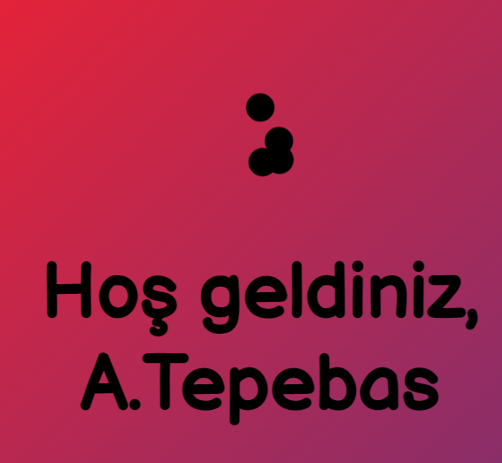

# Dashboard


Patates Sevenler Dashboard Tanıtım


## A) Kontrol Paneline Giriş

 (1).gif>)

### 1. **Öncelikle** [**bu sayfaya**](https://dash.patatessevenler.com) **gitmeli ve** [**`Giriş YAP`**](https://discordapp.com/api/oauth2/authorize?response\_type=code\&client\_id=719749073967644673\&redirect\_uri=https%3A%2F%2Fdash.patatessevenler.com%2Fcallback\&scope=identify+guilds\&state=OFswrKyowLPCH80JEEpqCSpgWVBz4J) **butonuna tıklamalısınız.**

### 2. Sonrasında [yönlendirildiğiniz sayfa](https://discordapp.com/api/oauth2/authorize?response\_type=code\&client\_id=719749073967644673\&redirect\_uri=https%3A%2F%2Fdash.patatessevenler.com%2Fcallback\&scope=identify+guilds\&state=OFswrKyowLPCH80JEEpqCSpgWVBz4J) üzerinden botun discord profilinize erişmesine izin vermelisiniz.

### 3. Hesabınız ile giriş yaptıktan sonra sizleri böyle bir mesaj karşılayacaktır.


Tebrikler kontrol paneline başarıyla giriş yaptınız.


## B) Kontrol Paneli Kullanımı

### 1. Panelin sol üst köşesinden giriş yapmış olduğunuz hesabı görüntüleyebilirsiniz.

.png>)

### 2. Panelin sağ üst köşesinde bulunan menu butonu ile diğer sayfalara gidebilirsiniz.

.gif>)

.gif>)


Farenizin tekerleğini ileriye veya geriye çevirerekya da  klavyenizdeki yukarı ve aşağıoklarına basarak istatistikleriniz arasında gezinebilirsiniz.

