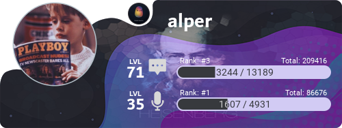

# 🏆Level Komutları

## Top

Sunucunun Genel ve haftalık olmak üzere ilk 5 chat ve sesli sıralamasındaki üyelerin listesini görüntüleyin.


```scala
!top
```



## Stat

Belirtilen üyenin tüm ses ve chat istatiklerini gösterir.


```scala
!stat [@kişi/id]!
```


<div align="left">


</div>

## Level

Kendinizin veya başka birinin sunucu sıralama kartını görüntüleyin.


```scala
!level [@kişi/id]
```


<div align="left">



</div>

## Skor

En fazla sunucu puanına veya global XP'ye sahip üyeleri görüntüleyin.


```scala
!skor [text/voice]
```


<div align="left">


</div>

## Invites

Sunucuya kaç kişiyi davet ettiğinizi görüntüleyin.


```scala
!!invites
```


## Sayım

Kendinizin veya başka birinin kaç defa sayı saydığını örüntüleyin.


```scala
!sayım [@kişi/id]
```


## Topsayım

En fazla sayım puanına sahip üyelerin listesini görüntüleyin.


```scala
!topsayım [sayfa numarası]
```


<div align="left">


</div>

## Topcoin

En fazla coine sahip üyelerin listesini görüntüleyin.


```scala
!topcoin 
```


<div align="left">


</div>

## Topkayıt

En fazla coine sahip üyelerin listesini görüntüleyin.


```scala
!topkayıt
```


<div align="left">


</div>
